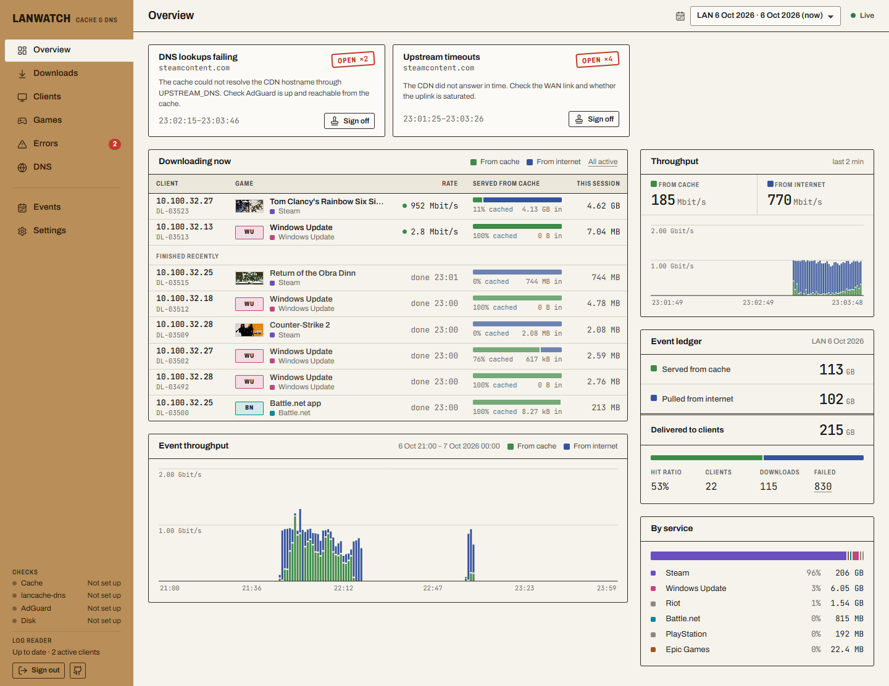
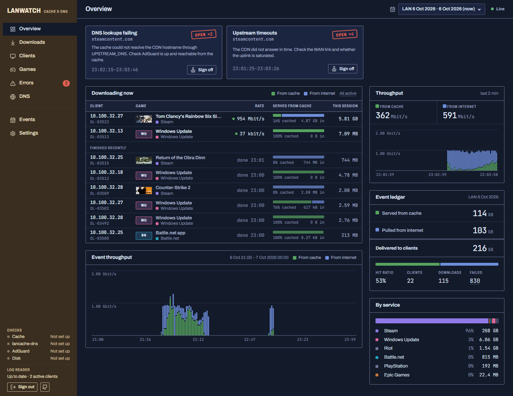
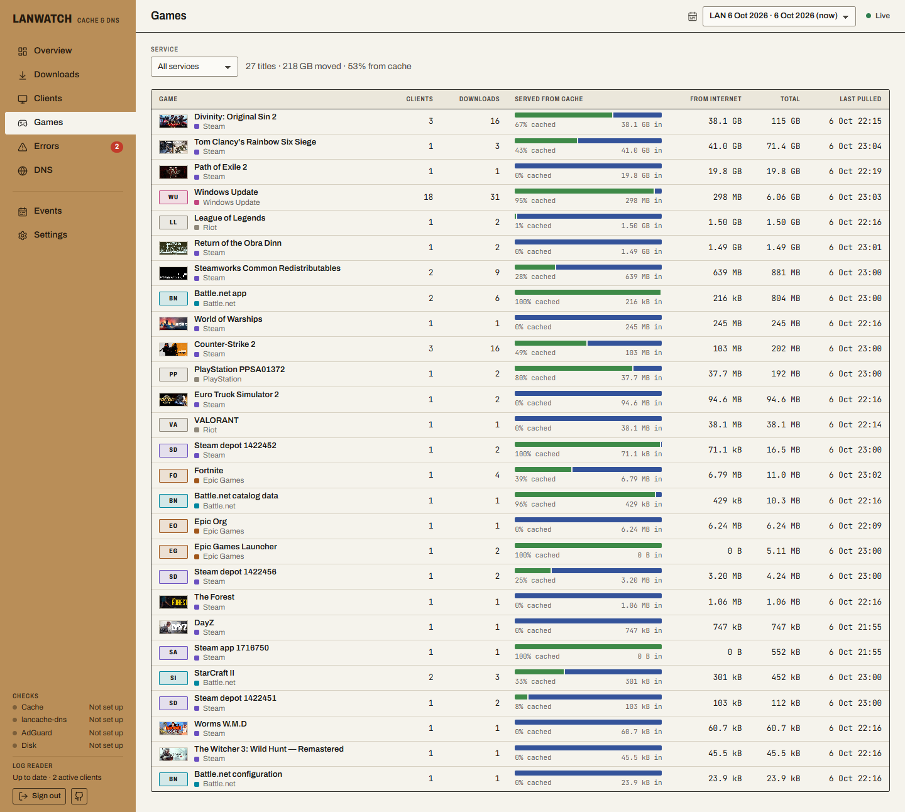
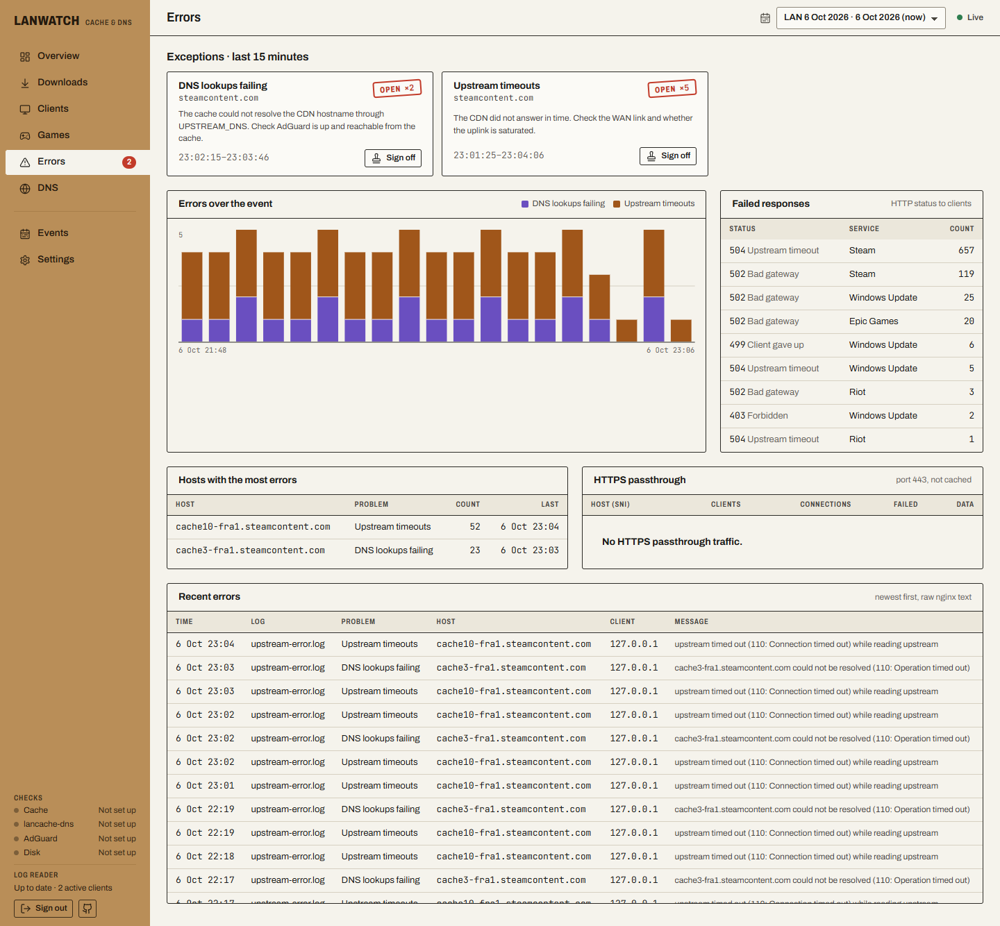
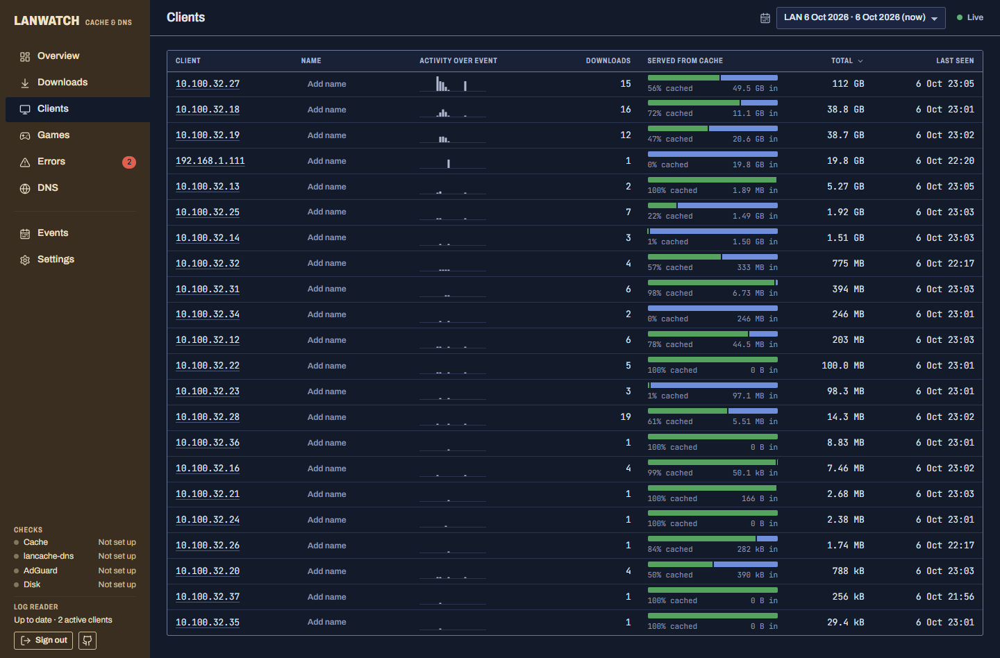

# LanWatch

A crew dashboard for a LAN party's [lancache](https://lancache.net) and the AdGuard Home behind it. It shows what is downloading, how much the cache saved, and what is failing. It runs as one container next to `lancachenet/monolithic` on the cache VM.



- **Live:** throughput split into from-cache and from-internet, active downloads per client and game, and new errors. All pushed every 2 s.
- **Exceptions:**
  - Upstream timeouts, DNS lookups failing through `UPSTREAM_DNS`, request loops (508), and HTTPS without SNI.
  - Health probes: cache heartbeat, lancache-dns answer, cache disk.
  - From AdGuard: an unreachable AdGuard, and clients that bypass the cache by asking AdGuard for CDN names directly.
  - Each exception stays stamped until a crew member signs it off. A new occurrence opens it again.
- **History by LAN event:** events are detected from 12-hour gaps in traffic, and you can rename or adjust them. History covers:
  - downloads;
  - clients, with nicknames;
  - games: Steam depots resolved to names and art, and Battle.net, Epic and Riot titles named from their launcher codes;
  - errors;
  - HTTPS passthrough.
- **Access:** one shared crew password protects everything.

Stack: ASP.NET Core (.NET 10), Blazor WebAssembly, SignalR and SQLite. LanWatch reads lancache's own log files read-only and stores only aggregates, so 1M log lines take about 5 s to import.

## Screenshots

| | |
|---|---|
|  |  |
| **Overview, dark theme.** The theme follows the computer, or pick one in Settings. | **Games.** Per title: clients, downloads, and the cache/internet split. |
|  |  |
| **Errors.** Every error class is explained in plain words, with what to check next. | **Clients.** Name machines ("Table 4") so the dashboard speaks in seats, not IPs. |

## Run it next to lancache

1. On the cache VM, clone this repo next to the lancache folder and copy the compose file into the lancache folder:
   ```
   cd ~ && git clone https://github.com/mortenfaerk/lanwatch.git   # ~/lanwatch next to ~/lancache
   cp ~/lanwatch/deploy/docker-compose.lanwatch.yml ~/lancache/
   ```
2. Add to the lancache `.env`:
   ```
   LANWATCH_PASSWORD=choose-something
   LANWATCH_SRC=../lanwatch          # only if the clone is somewhere else
   ADGUARD_URL=http://10.0.0.53      # optional: your AdGuard Home
   ADGUARD_USER=admin
   ADGUARD_PASSWORD=...
   STEAMGRIDDB_API_KEY=...           # optional: art for Battle.net / Epic / Riot games
   ```
3. Start it from the lancache folder:
   ```
   docker compose -f docker-compose.yml -f docker-compose.lanwatch.yml up -d --build
   ```
4. Open `http://<cache-ip>:8080` and sign in with the crew password.

The first start imports the whole log history. Steam game names download from the SteamDepotFinder dataset (about 2.5 MB) and are kept in SQLite, so they still resolve when the event's internet is down. Game art is cached on first view.

If the lancache logs aren't world-readable (`ls -l ${CACHE_ROOT}/logs`), uncomment `user: "0"` in the compose file.

### Updating

**Settings → Updates** shows the running build and compares it with this repository. It lists any new commits and has the commands ready to copy:
```
git -C ~/lanwatch pull
cd ~/lancache && docker compose -f docker-compose.yml -f docker-compose.lanwatch.yml up -d --build lanwatch
```
History survives updates because it lives in the `lanwatch-data` volume. LanWatch deliberately does not update itself: that would need the Docker socket mounted into it, which is root access to the VM.

### Behind nginx (HTTPS)

Publish LanWatch on localhost only (`127.0.0.1:8080:8080` in the compose file) and proxy to it. The live feed uses WebSockets, so pass the upgrade headers through:
```nginx
location / {
    proxy_pass http://127.0.0.1:8080;
    proxy_http_version 1.1;
    proxy_set_header Upgrade $http_upgrade;
    proxy_set_header Connection "upgrade";
    proxy_set_header Host $host;
    proxy_set_header X-Forwarded-For $proxy_add_x_forwarded_for;
    proxy_set_header X-Forwarded-Proto $scheme;
    proxy_read_timeout 1h;   # keep the live connection open
}
```
LanWatch trusts `X-Forwarded-For`/`X-Forwarded-Proto` from proxies on private networks. That keeps the login rate limit per client and the session cookie `Secure`. If nginx sits on a public address, list it in `TRUSTED_PROXIES`.

### Game art

- **Steam games:** header art comes from Steam's CDN.
- **Battle.net, Epic and Riot:** these launchers expose only internal product codes (`/tpr/ovw/`, `/Builds/Fortnite/`) and have no public metadata API. LanWatch names the common codes from a built-in table ([`KnownProducts.cs`](src/LanWatch.Server/Content/KnownProducts.cs); additions welcome).
  - Games that are also sold on Steam (Overwatch 2, Diablo IV, Call of Duty) reuse their Steam art.
  - For the rest, set `STEAMGRIDDB_API_KEY` ([free key](https://www.steamgriddb.com/profile/preferences)) and LanWatch fetches header art from [SteamGridDB](https://www.steamgriddb.com).
- **Anything without art** gets a label tile with the title's initials in its service colour.

### Configuration

| Variable | Default | Purpose |
|---|---|---|
| `LANWATCH_PASSWORD` | random, logged at start | Shared crew password |
| `LOGS_PATH` | `/logs` | lancache log folder (`${CACHE_ROOT}/logs`) |
| `DATA_PATH` | `/data` | SQLite database and cached art |
| `LANCACHE_URL` | – | e.g. `http://monolithic`; enables the heartbeat probe |
| `LANCACHE_DNS` | – | lancache-dns host or IP; enables the DNS probe |
| `LANCACHE_IP` | – | Expected answer(s) from lancache-dns |
| `CACHE_PATH` | – | Cache volume mounted read-only, for disk usage |
| `ADGUARD_URL` / `ADGUARD_USER` / `ADGUARD_PASSWORD` | – | AdGuard Home API |
| `ADGUARD_IGNORE_CLIENTS` | `LANCACHE_IP` + gateways | Clients allowed to ask AdGuard for cache domains (lancache-dns itself) |
| `STEAMGRIDDB_API_KEY` | – | Art for Battle.net / Epic / Riot titles |
| `TRUSTED_PROXIES` | private ranges | IPs or CIDRs of reverse proxies allowed to set `X-Forwarded-*` |
| `LANWATCH_REPOSITORY` | this repo | GitHub repo for the rail link and the update check (for forks) |
| `GITHUB_TOKEN` | – | Read-only token; only needed if your fork is private |
| `DOCKER_GATEWAY_IPS` | `172.17.0.1,172.18.0.1` | Bridge gateways; real client taken from X-Forwarded-For |
| `ERROR_LOG_UTC_OFFSET` | learned from access.log | Offset for nginx error logs, which have none |
| `TZ` | – | Container time zone |

Every option can also be set as `LanWatch__<Name>`; see `src/LanWatch.Server/LanWatchOptions.cs`.

## Develop

```
dotnet test
cd src/LanWatch.Server
LANWATCH_PASSWORD=testpw dotnet run    # Development: reads ../../logs, stores ../../data
```
`src/LanWatch.Server/LanWatch.Server.http` has smoke requests for every endpoint.

Layout:
- `src/LanWatch.Shared`: log parsers and API contracts.
- `src/LanWatch.Server`: ingestion, API, SignalR hub, health and AdGuard pollers.
- `src/LanWatch.Client`: the WebAssembly UI.
- `tests/`: unit and integration tests.

The design system ("freight manifest") is documented in `DESIGN.md`, and product context is in `PRODUCT.md`.

## Known limits

- **Hidden client IPs.** Traffic that reaches monolithic through Docker's userland proxy shows up as the bridge gateway, and the real client IP is lost. LanWatch labels it "Hidden behind Docker".
- **Partial name mapping.** Launcher product codes outside the built-in table, and PlayStation title ids, show as codes.
- **Time zones.** The event detector works in UTC hours. Default event names use the UTC date.
